# Project Details - iTop to Power BI Pipeline

## 1. Purpose

This project automates the preparation of iTop incident data for Power BI.
It can ingest data from three sources:

- iTop REST API
- a local XLSX export from iTop
- a source workbook stored in SharePoint

Then it applies:

- normalization and PII masking
- optional AI enrichment for incident causes and monthly summaries
- optional Monetic classification
- star-schema modeling
- quality checks
- export to SharePoint or SQL

The final output is designed to be consumed by Power BI with either:

- a SharePoint-hosted Excel file
- SQL tables

---

## 2. High-level architecture

```mermaid
flowchart LR
    A[Source: iTop API / local XLSX / SharePoint XLSX] --> B[ETL transform.py]
    B --> C[AI enrichment ai_enrichment.py]
    C --> D[Monetic classification ai_enrichment_monetique.py]
    D --> E[Star schema modeling modeling.py]
    E --> F[Quality checks quality_checks.py]
    F --> G[Export Excel]
    G --> H[SharePoint upload or SQL load]
    H --> I[Power BI]
```



### Main modules

- `main.py` orchestrates the full run.
- `config.py` loads `.env` and validates the selected mode.
- `itop_client.py` reads data from iTop API.
- `xlsx_loader.py` reads local Excel files.
- `sharepoint_loader.py` uploads and downloads workbook files through Microsoft Graph.
- `transform.py` performs mapping, cleaning, PII filtering, and analytical column creation.
- `ai_enrichment.py` does UC1 classification and monthly summary generation.
- `ai_enrichment_monetique.py` performs the Monetic classification.
- `modeling.py` builds the star schema.
- `quality_checks.py` validates the final dataset.
- `sql_loader.py` pushes tables to SQL.

---

## 3. Data flow by input mode

### 3.1 API mode

The pipeline reads incidents directly from iTop through the REST API.
It uses incremental extraction based on the last successful run, unless `--full-refresh` is provided.

Flow:

1. `itop_client.py` extracts incidents
2. `transform.py` normalizes and cleans the dataset
3. `ai_enrichment.py` enriches causes and summary data if enabled
4. `ai_enrichment_monetique.py` classifies Monetic tickets if enabled
5. `modeling.py` builds the star schema
6. `quality_checks.py` validates the result
7. `main.py` exports and uploads the workbook or loads SQL tables

### 3.2 Local XLSX mode

The pipeline reads a local Excel export from iTop.
This is useful when the API is not available or when a manually exported file is already present.

Flow:

1. `xlsx_loader.py` reads the workbook
2. `transform.py` applies the ETL
3. AI, modeling, quality, and export continue as in API mode

### 3.3 SharePoint source mode

The pipeline downloads the source workbook from SharePoint first, then runs the same ETL and export process.

This is the preferred mode when:

- the source workbook is already stored in the same SharePoint location
- you want a fully SharePoint-driven flow
- you do not want to copy source files locally by hand

Flow:

1. `sharepoint_loader.py` downloads the source workbook
2. `xlsx_loader.py` reads the downloaded file
3. `transform.py` applies the ETL
4. AI, modeling, quality, and export continue normally
5. `sharepoint_loader.py` uploads the final modeled workbook back to SharePoint

---

## 4. Transformation pipeline

The ETL in `transform.py` is shared across input modes.

### E1 - Field mapping and renaming

- iTop source columns are mapped to a common internal schema
- only whitelisted columns are kept
- names are normalized to a snake_case structure

### E2 - Cleaning and normalization

- PII columns are dropped
- dates are parsed
- text is trimmed and normalized
- empty markers such as `.`, `-`, `N/A`, `RAS` are replaced
- `reference` is used as the deduplication key
- the latest `last_update` is kept when duplicates exist

### E3 - Analytical columns

The pipeline adds business and operational columns such as:

- `nature`
- `tto_real_min`
- `ttr_real_hours`
- `ttr_bucket`
- `is_open`
- `is_resolved`
- `is_rejected`
- `is_critical`
- SLA breach flags
- `root_cause_category`
- `has_root_cause`
- `has_ci`
- `has_parent_change`
- `created_month`
- `created_date`
- `resolved_date`
- `days_since_last_update`

### PII handling

Sensitive information is removed or masked before any downstream export.

Examples:

- requester emails
- personal phone numbers
- employee numbers
- client comments
- partner or provider email fields

The `INCLUDE_AGENT_NAME` flag controls whether `agent_name` is kept in clear text or hashed.

---

## 5. Star schema modeling

By default, the output is a star schema workbook.

### Tables produced

- `fact_incidents`
- `dim_service`
- `dim_subcategory`
- `dim_team`
- `dim_ci`
- `dim_priority`
- `dim_date`
- `ai_insights` when AI monthly summaries are present

### Design principles

- dimensions contain surrogate keys
- unknown or missing values get a `0` key row
- referential integrity is checked before export
- the fact table is the central analytical table for Power BI

### Legacy flat mode

If `--legacy-flat` is used, the pipeline exports a single table workbook instead of the star schema.

---

## 6. AI enrichment

### 6.1 UC1 incident cause enrichment

`ai_enrichment.py` classifies incidents using Groq when enabled.

Inputs sent to the model are limited to:

- `root_cause_raw`
- `solution`

Sensitive data is redacted before sending.

The result adds:

- `ai_cause_category`
- `ai_cause_confidence`
- `ai_summary`
- `root_cause_category_final`

### 6.2 Monthly summary

A separate AI call can create a monthly executive summary based on aggregate metrics only.
No row-level data is sent.

### 6.3 AI cache behavior

The cache is stored in:

- `cache/ai_classifications.json`

Current behavior:

- a known reference is not reclassified in normal runs
- only unseen references are sent to the model
- cache hits keep the run fast and cheap

### 6.4 Monetic classification

`ai_enrichment_monetique.py` classifies only rows whose service subcategory is `Support Monétique`.

It uses:

- `ticket_title`
- `ticket_description`

It outputs:

- `monetique_macro_category`
- `monetique_theme`
- `monetique_responsabilite`
- `monetique_action_metier`
- `monetique_action_it`
- `monetique_ai_confidence`

The theme comes from a fixed business reference list.

---

## 7. SharePoint integration

### Source download

In `INPUT_MODE=sharepoint`, the source workbook is downloaded first from SharePoint.

Useful variables:

- `SHAREPOINT_TENANT_ID`
- `SHAREPOINT_CLIENT_ID`
- `SHAREPOINT_CLIENT_SECRET`
- `SHAREPOINT_DRIVE_ID`
- `SHAREPOINT_FOLDER_PATH`
- `SHAREPOINT_SOURCE_FILE_NAME`

### Destination upload

The final workbook is uploaded to SharePoint using Microsoft Graph.

Upload behavior:

- files up to 4 MB use a simple PUT upload
- larger files use an upload session and chunked fragments

### Common SharePoint issues

- `401/403`: permissions or token problem
- `404`: wrong file name or folder path
- `423`: file locked in SharePoint / Excel / Power BI

When a file is locked, close the workbook or release the lock and retry.

---

## 8. Configuration reference

### Input

- `INPUT_MODE=api|xlsx|sharepoint`
- `LOCAL_XLSX_PATH`
- `LOCAL_XLSX_SHEET_NAME`
- `SHAREPOINT_SOURCE_FILE_NAME`

### Output

- `OUTPUT_MODE=sharepoint|sql`
- `EXPORT_FILE`
- `MODEL_EXPORT_FILE`

### iTop

- `ITOP_BASE_URL`
- `ITOP_API_TOKEN`
- `ITOP_API_VERSION`
- `ITOP_CLASS`
- `ITOP_VERIFY_SSL`

### SharePoint

- `SHAREPOINT_TENANT_ID`
- `SHAREPOINT_CLIENT_ID`
- `SHAREPOINT_CLIENT_SECRET`
- `SHAREPOINT_SITE_ID`
- `SHAREPOINT_DRIVE_ID`
- `SHAREPOINT_FOLDER_PATH`

### SQL

- `SQL_DIALECT`
- `SQL_HOST`
- `SQL_PORT`
- `SQL_DATABASE`
- `SQL_USER`
- `SQL_PASSWORD`
- `SQL_TABLE`

### AI

- `AI_ENRICHMENT_ENABLED`
- `GROQ_API_KEY`
- `GROQ_MODEL`
- `GROQ_MODEL_SUMMARY`
- `GROQ_BASE_URL`
- `GROQ_MAX_REQ_PER_MIN`
- `GROQ_MAX_TOKENS_PER_MIN`
- `AI_CONFIDENCE_THRESHOLD`
- `AI_BATCH_SIZE`

### Monetic AI

- `MONETIQUE_AI_ENABLED`
- `MONETIQUE_CONFIDENCE_THRESHOLD`

---

## 9. Command line options

### Input and output

- `--input api`
- `--input xlsx`
- `--input sharepoint`
- `--output sharepoint`
- `--output sql`

### Behavior flags

- `--full-refresh`
- `--dry-run`
- `--legacy-flat`
- `--ai`
- `--ai-dry-run`
- `--ai-monetique-dry-run`
- `--skip-ai`

### Common commands

```bash
python main.py
python main.py --input sharepoint --output sharepoint
python main.py --input xlsx --output sharepoint --skip-ai
python main.py --input api --full-refresh
python main.py --legacy-flat --dry-run
```

---

## 10. Code return values

`main.py` returns:

- `0` on success
- `1` on configuration, extraction, validation, or export failure

This is useful for scheduled tasks and CI pipelines.

---

## 11. Testing

Run the test suite with:

```bash
python -m pytest tests/
```

Main coverage areas:

- ETL and transformation
- star schema modeling
- quality checks
- AI enrichment caching and redaction
- Monetic classification
- SharePoint source wiring

---

## 12. Scheduling examples

### Windows Task Scheduler

Typical command:

```bash
C:\Users\BestPc\Documents\BIAT-IT\itop_powerbi_pipeline\.venv\Scripts\python.exe main.py --input sharepoint --output sharepoint
```

### Cron example

```bash
0 6 * * 1-5 /opt/itop_pipeline/.venv/bin/python /opt/itop_pipeline/main.py --input sharepoint --output sharepoint
```

---

## 13. Git and GitHub workflow

### Local branch

The current feature branch used for this work is:

- `feature/sharepoint-source-flow`

### Create a new branch

```bash
git checkout -b feature/<your-topic>
```

### Check status

```bash
git status --short --branch
```

### Commit changes

```bash
git add .
git commit -m "Describe the change"
```

### Push to GitHub

```bash
git push -u origin feature/sharepoint-source-flow
```

### Create a repo with GitHub CLI

```bash
gh repo create <repo-name> --private --source . --remote origin --push
```

### Authenticate GitHub CLI

```bash
gh auth login
```

Use HTTPS + browser login if prompted.

---

## 14. Repository hygiene

The `.gitignore` should keep out:

- `.env`
- virtual environments
- caches
- logs
- generated Excel files
- `last_run.json`

This keeps the repo clean and avoids leaking secrets or generated artifacts.

---

## 15. Recommended usage pattern

For the SharePoint-driven flow that you wanted:

1. store the source workbook in SharePoint
2. set `INPUT_MODE=sharepoint`
3. set `OUTPUT_MODE=sharepoint`
4. set `SHAREPOINT_SOURCE_FILE_NAME` to the source workbook name
5. run:

```bash
python main.py --input sharepoint --output sharepoint
```

If you need to skip AI for a fast run:

```bash
python main.py --input sharepoint --output sharepoint --skip-ai
```

---

## 16. Notes

If the destination workbook is locked in SharePoint, the upload can fail with HTTP 423. In that case, close the file in Excel or Power BI and retry.

If you want the repo to be published with GitHub CLI:

```bash
gh auth login
gh repo create <repo-name> --private --source . --remote origin --push
```
